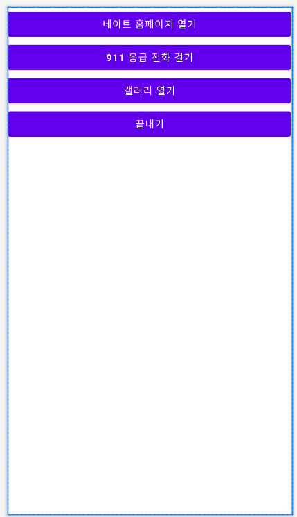
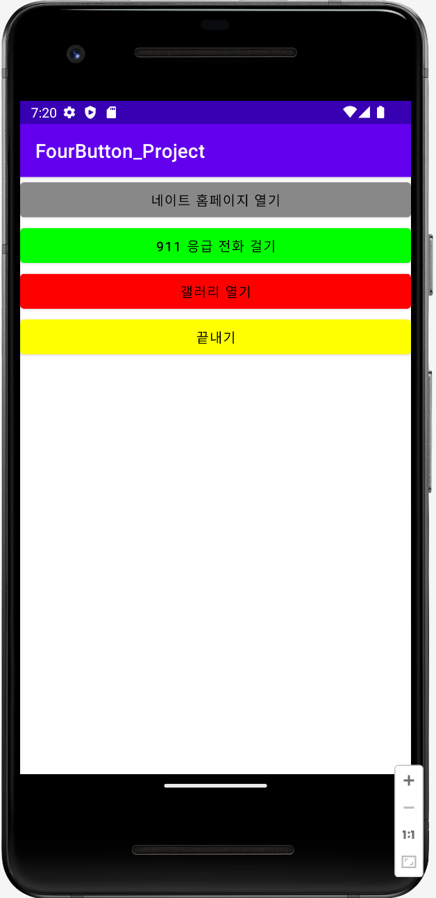
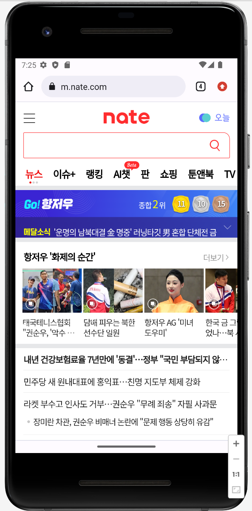
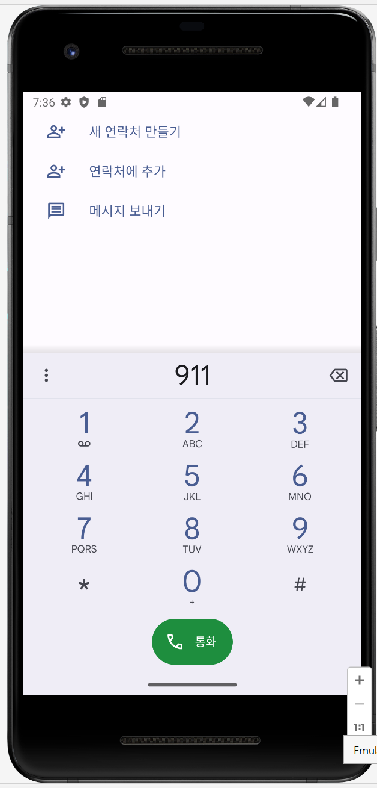
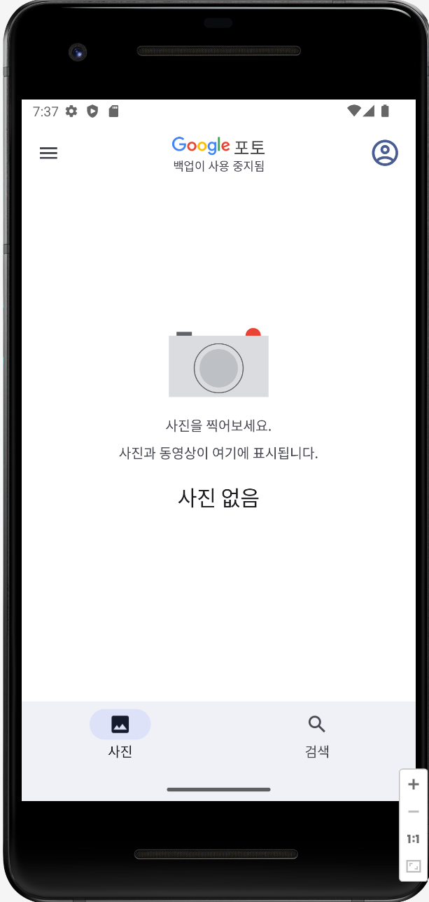
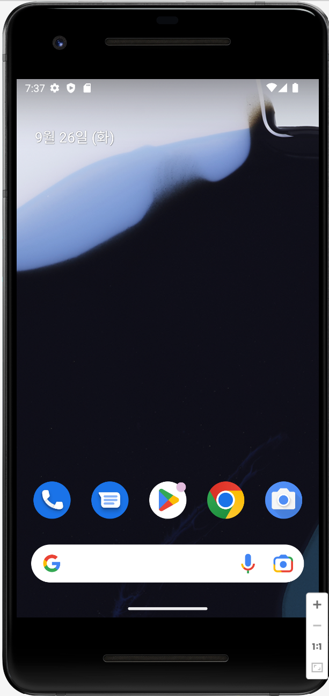

# FourButton Project

버튼 4개를 생성하고, 각 버튼을 클릭하면 필요한 내용이 작동하는 FourButton 프로젝트를 작성한다.

- 홈페이지 열기 
- 전화 걸기 
- 갤러리 열기 
- 애플리케이션 종료 
- 버튼 색상 변경 
- 버튼 글자 색상 변경 

## activity_main.xml 코드 

버튼 4개 생성 (@string을 참조해 strings.xml 내용을 참조함)
```xml
<?xml version="1.0" encoding="utf-8"?>
<LinearLayout xmlns:android="http://schemas.android.com/apk/res/android"
    xmlns:app="http://schemas.android.com/apk/res-auto"
    xmlns:tools="http://schemas.android.com/tools"
    android:layout_width="match_parent"
    android:layout_height="match_parent"
    tools:context=".MainActivity"
    android:orientation="vertical">

    <!-- layout_width: 버튼의 너비 | layout_height : 버튼의 높이 -->
    <!-- id : "@+id/지정 아이디" 형식을 따름 | @ : 리소스에 참조하라는 의미, @+는 리소스에 추가하라는 의미 -->

    <!-- button1 코드 -->
    <Button
        android:layout_width="match_parent"
        android:layout_height="wrap_content"
        android:id="@+id/button1"
        android:text="@string/strBtn1"
        />

    <!-- button2 코드 -->
    <Button
        android:layout_width="match_parent"
        android:layout_height="wrap_content"
        android:id="@+id/button2"
        android:text="@string/strBtn2"
        />

    <!-- button3 코드 -->
    <Button
        android:layout_width="match_parent"
        android:layout_height="wrap_content"
        android:id="@+id/button3"
        android:text="@string/strBtn3"
        />

    <!-- button4 코드 -->
    <Button
        android:layout_width="match_parent"
        android:layout_height="wrap_content"
        android:id="@+id/button4"
        android:text="@string/strBtn4"
        />

</LinearLayout>
```

## stings.xml 코드 

activity.xml에 참조할 내용들을 기입한다. 
```xml
<resources>
    <string name="app_name">FourButton_Project</string>
    <string name = "strBtn1">네이트 홈페이지 열기</string>
    <string name = "strBtn2">911 응급 전화 걸기</string>
    <string name = "strBtn3">갤러리 열기</string>
    <string name = "strBtn4">끝내기</string>
</resources>
```

## MainActivity.java 코드 

버튼을 전역변수로 선언하고,  버튼 변수에 대한 객체를 대입해준다. 
버튼 배경색상 및 글자 색상 변경 코드를 넣어준다. (setBackgroundColor, setTextColor)
버튼을 클릭했을 때 작동하는 클래스를 생성해준다. (setOnClickListener)
```java
package com.example.fourbutton_project;  // 패키지 이름, 자동완성됨

//관련 클래스, 인터페이스 import 문
import androidx.appcompat.app.AppCompatActivity;
import android.content.Intent;
import android.graphics.Color;
import android.net.Uri;
import android.os.Bundle;
import android.view.View;
import android.widget.Button;

// AppCompatActivity 클래스의 상속을 받아서 MainActivity 클래스를 정의함 (가장 기본적인 클래스이자 화면을 표시하는 클래스)
public class MainActivity extends AppCompatActivity {

    Button button1, button2, button3, button4;  // 버튼에 대한 변수를 전역 변수(클래스 변수)로 선언

    @Override   // 다음에 나오는 메소드가 오버라이드 됨
    public void onCreate(Bundle savedInstanceState) {    //오버라이딩한 onCreate() 메소드로, 가장 기본이 되는 메소드임 - main 함수 개념
        super.onCreate(savedInstanceState);        // 슈퍼 클래스인 Activity 클래스의 onCreate() 메소드를 호출함
        setContentView(R.layout.activity_main);    // setContentView()는 레이아웃을 화면에 표시해줌, (R.layout.activity_main) : activity_main.xml 파일을 의미

        //button1,2,3,4 변수에 버튼 객체를 대입함 (activity_main.xml에서 만든 버튼을 button1,2,3,4 변수로 제어 가능)
        button1 = (Button) findViewById(R.id.button1);
        button2 = (Button) findViewById(R.id.button2);
        button3 = (Button) findViewById(R.id.button3);
        button4 = (Button) findViewById(R.id.button4);

        // 버튼 배경 색상 변경 (setBackgroundColor)
        button1.setBackgroundColor(Color.GRAY);
        button2.setBackgroundColor(Color.GREEN);
        button3.setBackgroundColor(Color.RED);
        button4.setBackgroundColor(Color.YELLOW);

        // 버튼 글자 색상 변경 (setTextColor)
        button1.setTextColor(Color.BLACK);
        button2.setTextColor(Color.BLACK);
        button3.setTextColor(Color.BLACK);
        button4.setTextColor(Color.BLACK);

        // 버튼을 클릭했을 때 작동하는 클래스를 익명 내부 클래스(anonymous inner class)로 정의함
        button1.setOnClickListener(new View.OnClickListener() {
            // 버튼을 클릭했을 때 실제로 작동하는 오버라이드 된 메소드 (버튼을 클릭했을 때 작동하는 코드)
            @Override
            // onClick 메소드 : 버튼을 클릭했을 때 작동하기 원하는 모든 코드들을 기입하는 공간
            public void onClick(View view) {
                // 홈페이지 열기
                Intent mIntent = new Intent(Intent.ACTION_VIEW, Uri.parse("http://m.nate.com"));
                startActivity(mIntent);
            }
        });

        // 버튼을 클릭했을 때 작동하는 클래스를 익명 내부 클래스(anonymous inner class)로 정의함
        button2.setOnClickListener(new View.OnClickListener() {
            // 버튼을 클릭했을 때 실제로 작동하는 오버라이드 된 메소드 (버튼을 클릭했을 때 작동하는 코드)
            @Override
            // onClick 메소드 : 버튼을 클릭했을 때 작동하기 원하는 모든 코드들을 기입하는 공간
            public void onClick(View view) {
                // 전화 걸기
                Intent mIntent = new Intent(Intent.ACTION_VIEW, Uri.parse("tel:/911"));
                startActivity(mIntent);
            }
        });

        // 버튼을 클릭했을 때 작동하는 클래스를 익명 내부 클래스(anonymous inner class)로 정의함
        button3.setOnClickListener(new View.OnClickListener() {
            // 버튼을 클릭했을 때 실제로 작동하는 오버라이드 된 메소드 (버튼을 클릭했을 때 작동하는 코드)
            @Override
            // onClick 메소드 : 버튼을 클릭했을 때 작동하기 원하는 모든 코드들을 기입하는 공간
            public void onClick(View view) {
                // 갤러리 열기
                Intent mIntent = new Intent(Intent.ACTION_VIEW, Uri.parse("content://media/internal/images/media"));
                startActivity(mIntent);
            }
        });

        // 버튼을 클릭했을 때 작동하는 클래스를 익명 내부 클래스(anonymous inner class)로 정의함
        button4.setOnClickListener(new View.OnClickListener() {
            // 버튼을 클릭했을 때 실제로 작동하는 오버라이드 된 메소드 (버튼을 클릭했을 때 작동하는 코드)
            @Override
            // onClick 메소드 : 버튼을 클릭했을 때 작동하기 원하는 모든 코드들을 기입하는 공간
            public void onClick(View view) {
                // 애플리케이션 종료
                finish();
            }
        });
    }
}
```

### ● activity_main.xml 결과 화면 
</img></p>
<br></br>

### ● MainActivity.java 결과 화면 
#### 프로그램 실행화면
</img></p>

#### 네이트 연결된 화면
</img></p>

### 911 응급 전화 걸기 화면 
</img></p>

### 갤러리 연결 화면 
</img></p>

### 프로그램 종료 화면 
</img></p>


