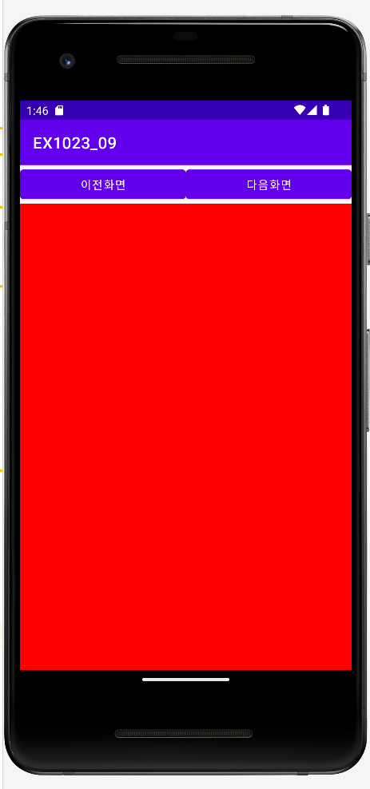
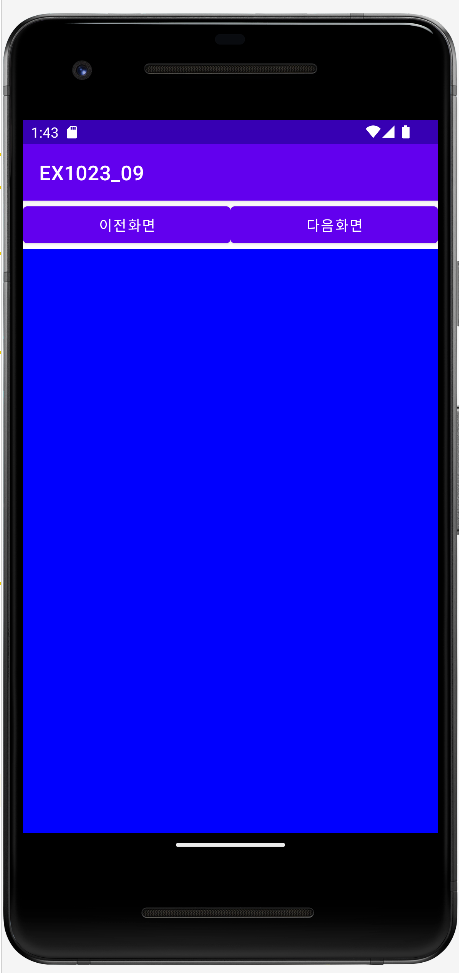
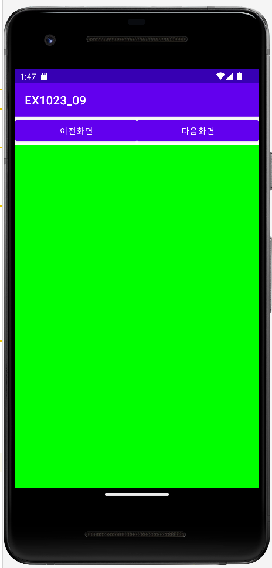

# 🚀 EX06-01

### **✍🏻 뷰플리퍼 실습 예제**

#### **📜 기능 조건**
-  뷰플리퍼는 여러 개의 위젯을 배치하고 필요에 따라 화면을 왼쪽 또는 오른쪽으로 밀어서 위젯을 하나씩 화면에 보여주는 방식의 뷰 컨테이너입니다.
- 초기화면은 빨강색으로, 이전화면은 파란색, 다음 화면은 초록색이 나오도록 프로그램이 구성되어있습니다.
<br></br>

## **🧐activity_main.xml**
화면 디자인 및 편집을 위한 주요 속성

- **activity_main.xml**

  ```xml
  <!-- 이전 화면 버튼 생성 -->
  <Button
            android:id="@+id/btnPrev"
            android:text=" 이전화면 " />

  <!-- 다음 화면 버튼 생성 -->
  <Button
            android:id="@+id/btnNext"
            android:text=" 다음화면 " />

  <!-- 뷰플리퍼 내부 설정 -->
  <ViewFlipper
        android:layout_width="match_parent"
        android:layout_height="match_parent"
        android:id="@+id/viewFlipper1">
   ```
<br></br>

## **🧐MainActivity.java**
activity_main,xml에서 선언한 위젯에 대응하는 기능 구현

- **초기화면**
  <p align="left">  


- **버튼 <이전화면>에 대한 클릭 리스너 선언**

  ```java
  btnPrev.setOnClickListener(new View.OnClickListener() {
    public void onClick(View v) {
        vFlipper.showPrevious();    // <이전화면>을 클릭 시 뷰플리퍼의 이전화면이 나옵니다.
    }
  });
  ```
  <p align="left">  
<br></br>

- **버튼 <다음화면>에 대한 클릭 리스너 선언**

  ```java
  btnNext.setOnClickListener(new View.OnClickListener() {
    public void onClick(View v) {
        vFlipper.showNext();     // <다음화면>을 클릭시 뷰플리퍼의 다음 화면이 나옵니다.
    }
  });
  ```
  <p align="left">  

<br></br>

  