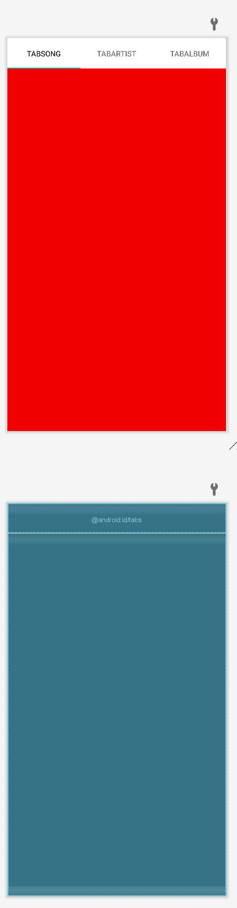
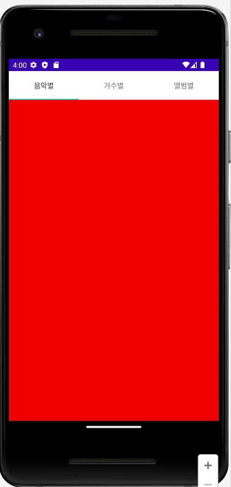
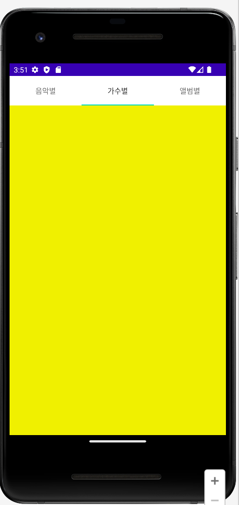
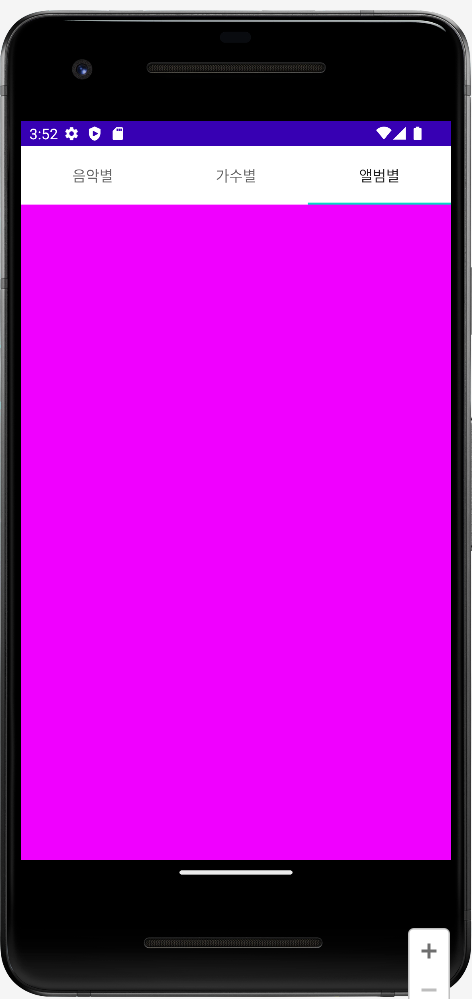

# 🚀 EX06-02

### **✍🏻 탭호스트 실습 예제**

#### **📜 화면 조건**
-  상단에 탭위치를 배치하고, 탭호스트 아이디, 탭위젯 아이디, 프레임레이아웃 앙이디를 지정합니다. (default, 변경 x)
- 하단에 프레임레이아웃을 배치하고, 각 탭 파트별로 레이아웃을 배치합니다. 
- `tapSong`= '#f00000' - 빨강색, `tapArtist`= '#f0f000' - 노란색, `tapAlbum`= '#f000ff' - 핑크색으로 구성합니다. 
<br></br>

#### **📜 기능 조건**
-  `@SuppressWarnings("deprecation")`: Android 5.0(롤리팝) 이후에서 탭액티비티를 사용하면 경고가 나오는 것을 막기 위한 코드 추가 
- `TabActivity`를 상속받습니다. 
- 각 파트별 탭스펙 설정 및 탭 호스트에 탭을 추가합니다. 
- 초기 화면에 표시될 기본 탭을 `음악별 탭`으로 설정합니다. 
<br></br>

## **🧐activity_main.xml**
화면 디자인 및 편집을 위한 주요 속성

- **activity_main.xml**

  ```xml
  <!-- 전체 XML을 탭호스트로 감쌉니다 -->
  <TabHost xmlns:android="http://schemas.android.com/apk/res/android"       
    android:layout_width="match_parent"   
    android:layout_height="match_parent"    
    android:id="@android:id/tabhost">

  <!-- 상단에 탭위치를 배치합니다 -->
  <TabWidget
    android:layout_width="match_parent"            
    android:layout_height="wrap_content"
    android:id="@android:id/tabs">
  </TabWidget>
  
  <!-- 하단에 프레임레이아웃을 배치합니다 -->
  <FrameLayout
    android:layout_width="match_parent"            
    android:layout_height="match_parent"
    android:id="@android:id/tabcontent">
   ```
  <p align="left">  
<br></br>

## **🧐MainActivity.java**
activity_main,xml에서 선언한 위젯에 대응하는 기능 구현

- **초기화면 (음악별 탭 설정)**
  ```java
  // "음악별" 탭 설정      
  TabSpec tabSpecSong = tabHost.newTabSpec("SONG").setIndicator("음악별");
  tabSpecSong.setContent(R.id.tabSong);  // "음악별" 탭이 선택되었을 때 표시될 내용 설정
  tabHost.addTab(tabSpecSong); // 탭 호스트에 탭 추가
  ```
  <p align="left">  
  <br></br>

- **가수별 탭 설정**
  ```java
  // "가수별" 탭 설정     
  TabSpec tabSpecArtist = tabHost.newTabSpec("ARTIST").setIndicator("가수별"); 
  tabSpecArtist.setContent(R.id.tabArtist);  // "가수별" 탭이 선택되었을 때 표시될 내용 설정
  tabHost.addTab(tabSpecArtist); // 탭 호스트에 탭 추가
  ```
  <p align="left">  
  <br></br>

- **앨범별 탭 설정**
  ```java
  // "앨범별" 탭 설정      
  TabSpec tabSpecAlbum = tabHost.newTabSpec("ALBUM").setIndicator("앨범별");
  tabSpecAlbum.setContent(R.id.tabAlbum);  // "앨범별" 탭이 선택되었을 때 표시될 내용 설정
  tabHost.addTab(tabSpecAlbum); // 탭 호스트에 탭 추가
  ```
  <p align="left">  
