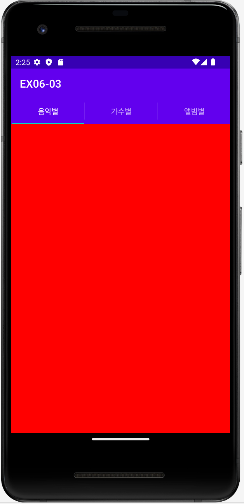
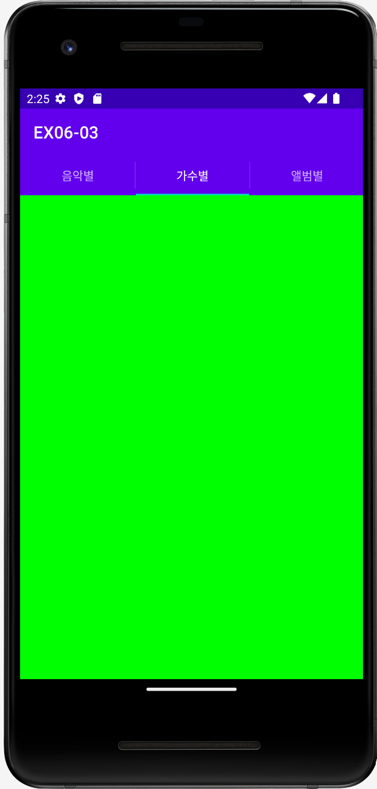

# 🚀 EX06-03

### **✍🏻 액션바/프래그먼트 실습 예제**

#### **📜 기능 조건**
- 액션바를 생성한 후, 탭위젯을 액션바에 등록하는 방법을 사용합니다.
- MainActivity에 TabListener 인터페이스를 구현해야 합니다. 
<br></br>

## **🧐MainActivity.java**
Java 코드로만 액션바, 프래그먼트 기능을 구현합니다. 

- **액션바 설정**
  ```java
  // 액션바 설정 (현재 액티비티에 연결된 액션바 객체를 반환하는 getSupportActionBar 메서드)
  ActionBar bar = getSupportActionBar();
  // 액션바의 모드를  탭호스트 모양인 NAVIGATION_MODE_TABS로 설정합니다.
  bar.setNavigationMode(ActionBar.NAVIGATION_MODE_TABS);
  ```
<br></br>

- **초기화면 (음악별 탭 설정)**
  ```java
  // "음악별" 탭 설정
  tabSong = bar.newTab();
  tabSong.setText("음악별");
  tabSong.setTabListener(this);  // 액션바의 각 탭에 대한 이벤트를 수신하는 리스너를 설정하는 부분(this -> MainActivity)
  bar.addTab(tabSong);     // 액션바에 탭 추가
  ```
  <p align="left">  
<br></br>

- **가수별 탭 설정**
  ```java
  // "가수별" 탭 설정
  tabArtist = bar.newTab();
  tabArtist.setText("가수별");
  tabArtist.setTabListener(this);
  bar.addTab(tabArtist);    // 액션바에 탭 추가
  ```
  <p align="left"> 
<br></br>

- **앨범별 탭 설정**
  ```java
  // "앨범별" 탭 설정
  tabAlbum = bar.newTab();
  tabAlbum.setText("앨범별");
  tabAlbum.setTabListener(this);
  bar.addTab(tabAlbum);     // 액션바에 탭 추가
  ```
  <p align="left"> 
<br></br>
  
- **탭 이름에 따라 배경색 설정**
  ```java
  if ("음악별".equals(tabName))
    baseLayout.setBackgroundColor(Color.RED);
  if ("가수별".equals(tabName))
    baseLayout.setBackgroundColor(Color.GREEN);
  if ("앨범별".equals(tabName))
    baseLayout.setBackgroundColor(Color.BLUE);
  ```
<br></br>