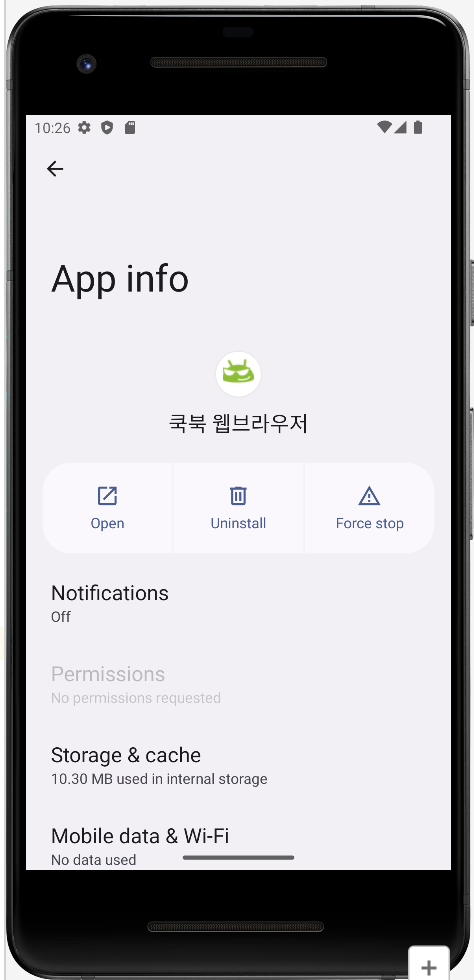
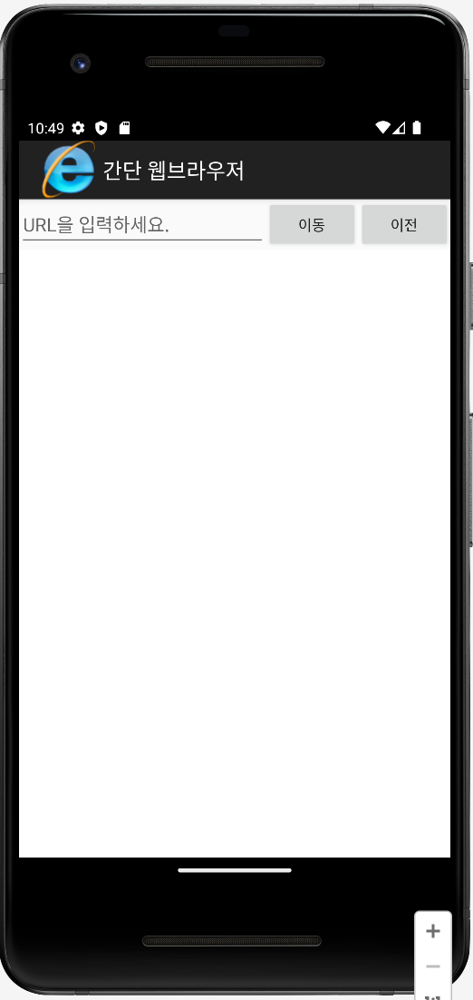
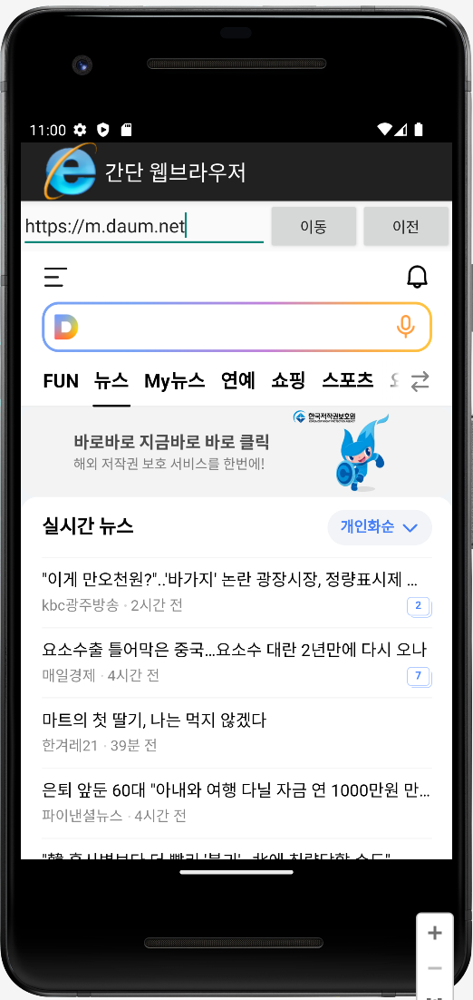

# 🚀 Project 06-02

### **💻 간단 웹브라우저 앱 만들기**
#### **📜 화면 디자인 조건**
- 리니어레이아웃을 하나 더 만들고 그 안에 에디트텍스트 1개와 버튼 2개를 구성합니다. 
- 하단에 웹뷰를 만듭니다. 
- 각 위젯의 아이디는 edtUrl, btnGo, btnBack, webView1로 합니다.
<br></br>

#### **📜 기능 조건**
- `getSupportActionBar().setDisplayShowHomeEnabled(true);` : 현재 액티비티에서 ActionBar에 홈 아이콘을 표시하도록 설정합니다.
- `getSupportActionBar().setIcon(R.drawable.web);` : ActionBar의 아이콘을 web 이미지로 설정합니다.
- `webSet.setJavaScriptEnabled(true);` : 웹뷰에서 자바스크립트가 작동되게 합니다.
<br></br>

#### **📜 Manifest 변경 조건**
- `<uses-permission android:name="android.permission.INTERNET" />` : 프로젝트의 인터넷 사용을 허가합니다.
- 앱이 실행되기 전의 아이콘 모양, 앱의 레이블, 화면 상단에 보이는 로고 모양, 실행된 화면 상단에 나오는 타이틀 등을 변경합니다. 
<br></br>

 
 
 


## **🧐activity_main.xml**
```xml
<LinearLayout xmlns:android="http://schemas.android.com/apk/res/android"
    android:layout_width="fill_parent"
    android:layout_height="fill_parent"
    android:orientation="vertical">

    <LinearLayout
        android:id="@+id/linearLayout1"
        android:layout_width="match_parent"
        android:layout_height="wrap_content">

        <EditText
            android:id="@+id/edtUrl"
            android:layout_width="wrap_content"
            android:layout_height="wrap_content"
            android:layout_weight="1"
            android:hint="URL을 입력하세요."
            android:singleLine="true"></EditText>

        <Button
            android:id="@+id/btnGo"
            android:layout_width="wrap_content"
            android:layout_height="wrap_content"
            android:text="이동" />

        <Button
            android:id="@+id/btnBack"
            android:layout_width="wrap_content"
            android:layout_height="wrap_content"
            android:text="이전" />

    </LinearLayout>

    <WebView
        android:id="@+id/webView1"
        android:layout_width="match_parent"
        android:layout_height="match_parent"
        android:clickable="true" />

</LinearLayout>
```
<br></br>

## **🧐MainActivity.java**
```java
package com.example.project_06_02;

import androidx.appcompat.app.AppCompatActivity;
import android.os.Bundle;
import android.view.View;
import android.webkit.WebSettings;
import android.webkit.WebView;
import android.webkit.WebViewClient;
import android.widget.Button;
import android.widget.EditText;

// Android 5.0(롤리팝) 이후에서 탭액티비티를 사용하면 경고가 나오는 것을 막기 위한 코드
@SuppressWarnings("deprecation")
public class MainActivity extends AppCompatActivity {

    // activity_main.xml의 4개 위젯에 대응할 위젯 변수 4개를 전역변수로 선언합니다
    EditText edtUrl;
    Button btnGo, btnBack;
    WebView web;

    @Override
    public void onCreate(Bundle savedInstanceState) {
        super.onCreate(savedInstanceState);
        setContentView(R.layout.activity_main);
        getSupportActionBar().setDisplayShowHomeEnabled(true);
        getSupportActionBar().setIcon(R.drawable.web);

        // 4개의 변수에 위젯을 대입합니다.
        edtUrl = (EditText) findViewById(R.id.edtUrl);
        btnGo = (Button) findViewById(R.id.btnGo);
        btnBack = (Button) findViewById(R.id.btnBack);
        web = (WebView) findViewById(R.id.webView1);

        // CookWebViewClient 클래스를 생성하여 웹뷰에 대입
        web.setWebViewClient(new CookWebViewClient());

        // WebSettings 클래스를 이용하여 줌 버튼 컨트롤이 화면에 보이게 합니다
        WebSettings webSet = web.getSettings();
        webSet.setBuiltInZoomControls(true);

        // 웹뷰에서 자바스크립트가 작동되게 합니다.
        webSet.setJavaScriptEnabled(true);

        // 이동 버튼에 대한 클릭리스너 정의
        btnGo.setOnClickListener(new View.OnClickListener() {
            public void onClick(View v) {
                // 에디트텍스트에 입력한 URL 웹페이지가 웹뷰에 나오게 합니다.
                web.loadUrl(edtUrl.getText().toString());
            }
        });

        // 이전 버튼에 대한 클릭리스너 정의
        btnBack.setOnClickListener(new View.OnClickListener() {
            public void onClick(View v) {
                // 웹뷰의 이전 화면으로 돌아갑니다.
                web.goBack();
            }
        });
    }

    // WebViewClient의 상속을 받는 CookWebViewClient 클래스를 정의
    class CookWebViewClient extends WebViewClient {
        @Override
        // shouldOverrideUrlLoading() :WebView에서 새로운 URL을 로딩할 때 호출되는 메서드
        public boolean shouldOverrideUrlLoading(WebView view, String url) {
            return super.shouldOverrideUrlLoading(view, url);
        }
    }
}
```
<br></br>

## **🧐ManiFest.xml**
```xml
<?xml version="1.0" encoding="utf-8"?>
<manifest xmlns:android="http://schemas.android.com/apk/res/android"
    package="com.example.project_06_02">

    <uses-permission android:name="android.permission.INTERNET" />

    <application
        android:allowBackup="true"
        android:icon="@drawable/emo_im_cool"
        android:label="쿡북 웹브라우저"
        android:logo="@drawable/web"
        android:theme="@style/Theme.AppCompat.Light.DarkActionBar">

        <activity android:name=".MainActivity"
            android:label="간단 웹브라우저"
            android:exported="true">

            <intent-filter>
                <action android:name="android.intent.action.MAIN" />

                <category android:name="android.intent.category.LAUNCHER" />
            </intent-filter>

        </activity>

    </application>

</manifest>
```