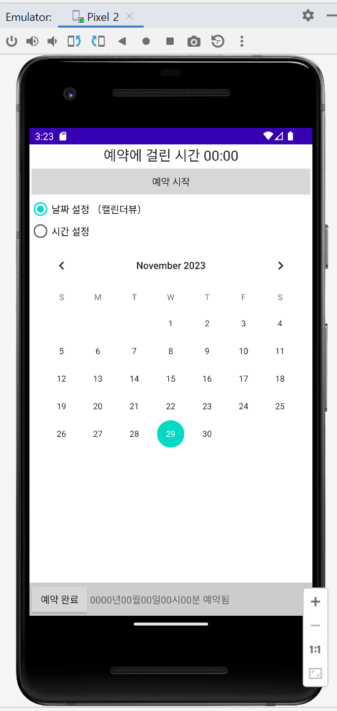
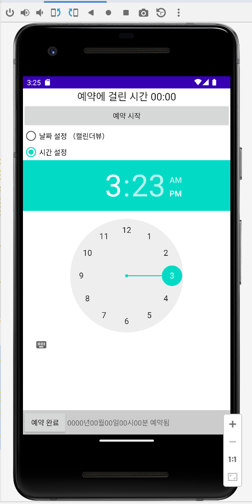
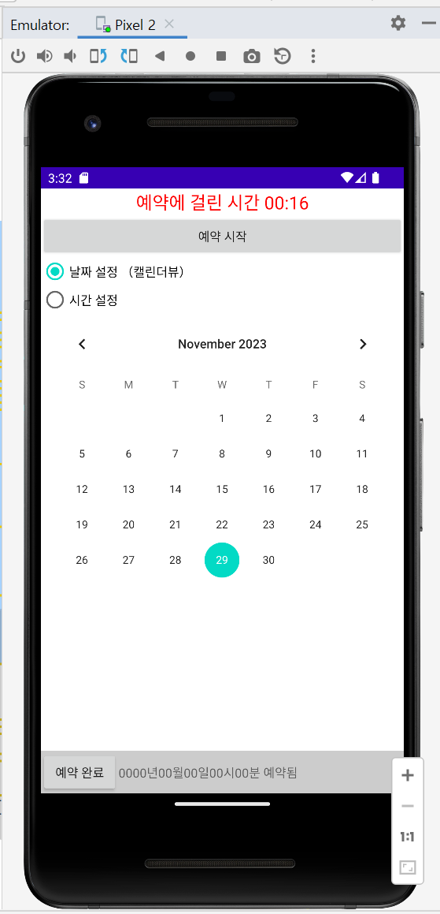
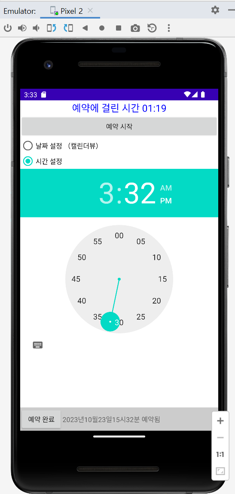

# 🚀 Project 6-1

### **📆 날짜/시간 예약 앱 만들기**

#### **✍🏻 기능 조건**
-  `타이머 기능` : 〈예약시작〉과 〈예약완료〉를 클릭하면 크로노미터가 타이머로 동작합니다. </br>
-  `날짜/시간 설정` : 〈날짜설정〉과 〈시간설정〉을 클릭하면 예약 날짜와 시간을 변경할 수 있습니다.</br>
- 〈예약완료〉를 클릭하면 설정한 날짜와 시간이 결정됩니다.
<br></br>

#### **✍🏻 화면 디자인 및 편집 조건**
- 리니어레이아웃 1
    -  크로노미터 1개, 버튼 1개를 생성합니다. 위젯의 아이디는 chronometer1, btnStart로 합니다. 

-  라디오그룹 
   -  라디오 버튼 2개를 생성합니다. 위젯의 아이디는 rdoCal, rdoTime으로 합니다.

-  리니어레이아웃 2
   -  리니어레이아웃의 layout_weight를 1로 설정합니다.
   -  프레임레이아웃을 두고 안에 캘린더뷰 1개，타임피커 1개를 생성합니다.
   -  위젯의 아이디는 calendarView1, timePicker1로 합니다.

-  리니어레이아웃 3
    -  버튼 1개, 텍스트뷰 10개를 생성합니다. 버튼의 아이디는 btnEnd로 생성합니다. 
    -  텍스트뷰는 홀수 차례에만 아이디를 tvYear, tvMonth, tvDay, tvHour, tvMinute로 합니다.
   <br></br>


## **🧐activity_main.xml**
화면 디자인 및 편집을 위한 주요 속성

- **activity_main.xml**

  ```xml
  <!-- 00:00과 같이 출력되도록 크로노미터 형식을 설정합니다. -->
  android:format="예약에 걸린 시간 %s" 

  <!-- 캘린더뷰가 포함된 리니어레이아웃이 나머지 높이를 꽉 채우도록 layout_weight를 1로 설정합니다-->
  android：layout_weight = "1" 

  <!-- 캘린더뷰와 타임피커가 동시에 들어가도록 프레임레이아웃을 설정합니다-->
  <FrameLayout></FrameLayout>
   ```
<br></br>

## **🧐MainActivity.java**
activity_main/xml에서 선언한 위젯에 대응하는 기능 구현

- **타임피커와 캘린더뷰가 보이지 않게 설정**

  ```java
   // 타임피커와 캘린더뷰가 보이지 않게 설정
   tPicker.setVisibility(View.INVISIBLE);          
   calView.setVisibility(View.INVISIBLE);

  ```
<br></br>

- **라디오 버튼 클릭 이벤트 리스너 (캘린더뷰만 보이게)**
  
  ```java
  // 라디오 버튼을 클릭하면 CalenderView와 TimePicker 중 하나씩만 보이도록 클릭 이벤트 리스너를 작성합니다.
  // CalenderView 클릭시 CalenderView만 보이게 설정
  rdoCal.setOnClickListener(new View.OnClickListener() { 
    @Override
    public void onClick(View view) {
        tPicker.setVisibility(View.INVISIBLE);
        calView.setVisibility(View.VISIBLE);
    }
  });
  ```
  <p align="left">  
<br></br>


- **라디오 버튼 클릭 이벤트 리스너 (타임피커만 보이게)**

  ```java
  // TimePicker 클릭시 TimePicker만 보이게 설정
  rdoTime.setOnClickListener(new View.OnClickListener() {
    @Override
    public void onClick(View view) {
        tPicker.setVisibility(View.VISIBLE);
        calView.setVisibility(View.INVISIBLE);
    }             
  });
  ```
  <p align="left">  

<br></br>

- **예약 시작/예약 완료 클릭 이벤트 리스너 (예약 시작)**

  ```java
  // <예약 시작>을 클릭하면 크로노미터가 시작되고 <예약완료>를 클릭하면 정지되도록 클릭 이벤트 리스너를 작성합니다.
  // <예약 시작>시 크로노미터 시작&텍스트 컬러 빨강색으로 작동
  btnStart.setOnClickListener(new View.OnClickListener() {     @Override
  public void onClick(View view) {
    // chronometer를0으로 초기화한다. (예약시작을 클릭할 때마 초기화됨)
    chrono.setBase(SystemClock.elapsedRealtime()); 
    chrono.start();    // chronometer 시작
    // 타이머 시작시 글자색 빨간색으로 설정                   				
    chrono.setTextColor(Color.RED);
    }
  });
  ```
    <p align="left">  
    <br></br>

- **예약 시작/예약 완료 클릭 이벤트 리스너 (예약 완료)**

  ```java
  // <예약 시작>을 클릭하면 크로노미터가 시작되고 <예약완료>를 클릭하면 정지되도록 클릭 이벤트 리스너를 작성합니다.
  // <예약 종료> 시 크로노미터 종료 및 텍스트 컬러 파랑색으로 작동
  btnEnd.setOnClickListener(new View.OnClickListener() {
    @Override
    public void onClick(View view) {
        chrono.stop();   // chronometer 종료
        chrono.setTextColor(Color.BLUE);

        // <예약완료>를 클릭하면 캘린더뷰에서 설정한 연, 월, 일과 타임피커에서 설정한 시, 분이 맨 아래 텍스트뷰에 채워지게 합니다.
        // 캘린더뷰에서 선택한 연,월,일을 해당하는 텍스트뷰에 채웁니다.
        tvYear.setText(Integer.toString(selectYear));
        tvMonth.setText(Integer.toString(selectMonth));
        tvDay.setText(Integer.toString(selectDay));
        
        // 타임피커에서 설정한 시각과 분을 구하여 해당하는 텍스트뷰에 채웁니다.
        tvHour.setText(Integer.toString(tPicker.getCurrentHour()));
        tvMinute.setText(Integer.toString(tPicker.getCurrentMinute()));
    }
  });
  
  ```
    <p align="left">  
    <br></br>

- **월에 +1을 해주는 부분** </br>
  CalendarView에서 월을 나타내는 값은 0부터 시작하는 것은 Calendar 클래스의 월 상수와의 일관성을 유지하기 위한 설계 선택입니다. </br>

  Calendar 클래스는 월을 0부터 11까지의 정수로 표현합니다. 예를 들어, 0은 1월을 나타내고, 1은 2월을 나타냅니다. 이와 같은 방식으로 월을 표현하는 것은 자바에서 일반적인 관행입니다. </br>

  따라서 CalendarView에서 월을 나타내는 값도 Calendar 클래스와 일치시키기 위해 0부터 시작하는 것입니다. 이렇게 함으로써 개발자가 Calendar 클래스와 CalendarView에서 월을 다룰 때 일관성을 유지할 수 있습니다. </br>

  ```java
  // 캘린더뷰를 클릭하면 선택한 년, 월, 일이 전역변수에 대입됩니다. 월은 0부터 시작하므로+1을 더해줍니다.
  calView.setOnDateChangeListener(new CalendarView.OnDateChangeListener() {
    @Override
    public void onSelectedDayChange(@NonNull CalendarView calendarView, int year, int month, int dayOfMonth) {
        selectYear=year;
        selectMonth=month+1;
        selectDay=dayOfMonth;
    }
  });
  ```