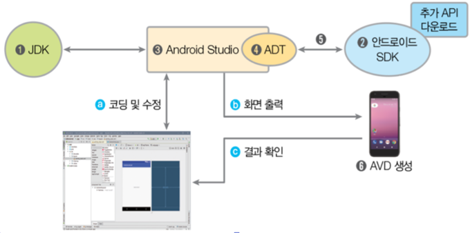
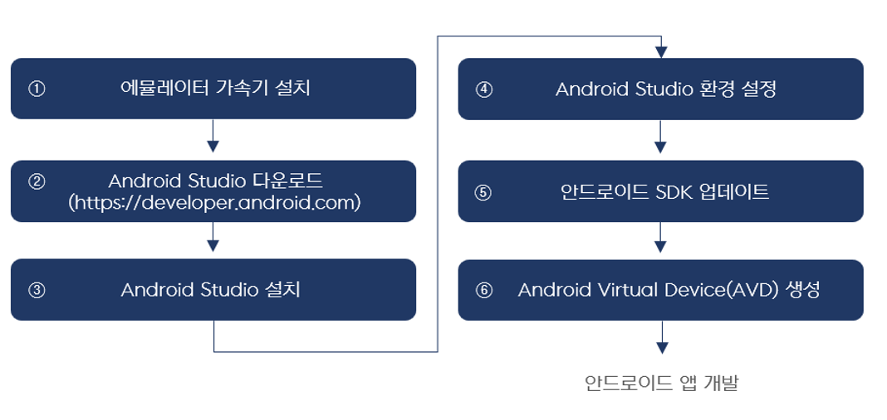

# 안드로이드 특징 총정리

### **스마트폰의 개요**
통화 기능 + 컴퓨터 + 다양한 기능 내장(MP3, 카메라, BMB, GPS 등)     

### **스마트폰의 역사**
- 1992년 IBM사의 사이먼(최초)
- 1996년 노키아 9000
- 2002년 마이크로소프트 포켓 PC 
- 2007년 아이폰 
- 2008년 안드로이드 폰 
- 2010년 윈도폰 7 
  

### **스마트폰의 개요**
안드로이드 운영체제를 탑재한 스마트폰이 약 72%, 아이폰이 약 26%, 윈도폰이 약 0.02%를 차지.
  

### **안드로이드 주요 기능**
- 애플리케이션 프레임워크를 통해 제공되는 API를 사용함으로써 코드를 재사용하여 효율적이고 빠른 애플리케이션 개발이 가능.
- 모바일 기기에 최적화된 달빅(Dalvik) 또는 아트(Android RunTime, ART) 런타임을 제공. 
- 모바일용 데이터베이스인 SQLite를 제공.
- 모바일 기기에 내장된 각종 하드웨어(블루투스，카메라, 나침반，와이파이 등)를 잘 지원.
- Eclipse IDE 또는 Android Studio를 통해 강력하고 빠른 개발 환경을 제공.
  

### **안드로이드의 특징**
① 안드로이드의 핵심 커널은 리눅스로 구성되어 있음  
② 안드로이드 애플리케이션 개발 언어로 Java를 사용함 
③ 안드로이드 SDK에 많은 라이브러리를 포함하고 있어 쉽게 개발할 수 있음   
④ 오픈소스를 지향함 
⑤ 지속적인 업그레이드를 제공함 
  

### **안드로이드 개발 환경 구성**

</img>

  

### **안드로이드 개발 환경 설치 순서**

</img>

  
