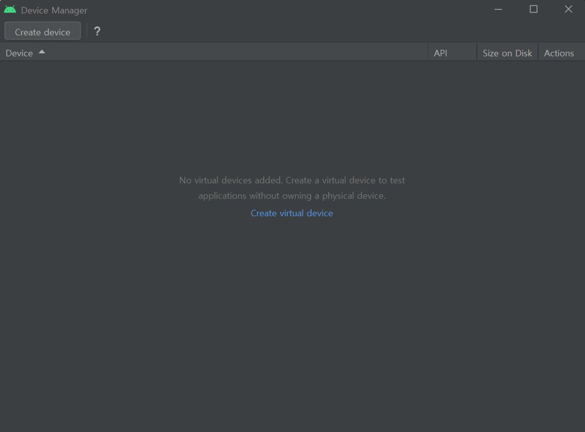
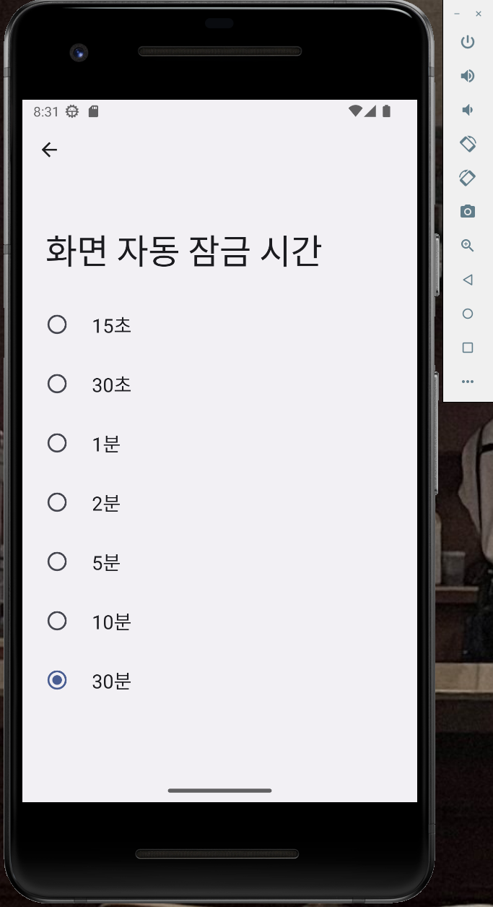

# 안드로이드 스튜디오 설치하기
  

### **Android Studio Dolphin(2021.03.01)을 다운로드**
#### https://developer.android.com/studio/archive 접속 후 해당 버전 다운로드 
  

### **Android Studio Setup**
파일을 실행하고 초기화면에서 \<Next>를 클릭한다.  
[Choose Components]에서 "Android Virtual Device"의 체크를 끄고 \<Next>를 클릭한다.

</img>
</img>

  

Android Studio 설치될 폴더를 선택한다. 기본값으로 두고 \<Next>를 클릭한다.   
시작 메뉴 폴더를 생성하는 화면에서도 기본값으로 두고 \<Install>을 클릭한다. 

</img>
</img>

  

설치가 완료되면\<Next>를 클릭한다.
설치 완료 화면에서 “Start Android Studio”의 체크를 끄고 \<Finish>를 클릭한다.

</img>
</img>

  

# 안드로이드 실습 환경 구축 

### **Android Studio Setup Wizard**
[Install Type]은 기본값인 'Standard'를 선택하고\<Next>를 클릭한다.
[Darcula] 테마로 선택하고 \<Next>를 클릭한다.

</img>
</img>

  

[License Agreement] 창이 나오면 각 항목을 선택하고 \<Agree>를 클릭한 후 \<Finish>를 클릭하여 진행한다.  
[Download Component] 창이 나오고 한동안 안드로이드 SDK의 다운로드 및 설치가 진행된다.

</img>
</img>

  

다운로드 및 설치가 완료되면 \<Finish>를 클릭하여 종료한다.

</img>

  

### **Android Studio Customize**
Android Studio 초기화면이 나오면 [Customize]를 선택하고 'All Settings'를 클릭한다. 
자동 업데이트 기능을 끄고, 왼쪽의 [Appearance & Behavior]-[System Settings]-[Updates]를 선택하고 업데이트와 관련된 오른쪽의 체크를 모두 끈다.

</img>
</img>

  

소스코드의 행 번호가 보이도록 설정한다.  
왼쪽의 [Editor]-[General]-[Appearance]를 선택하고 오른쪽의 'Show line numbers'에 체크 표시한다. 

</img>

  

### **SDK Manager**
Android Studio 초기화면에서 왼쪽의 [Projects]를 선택하고 오른쪽 아래의 'More Actions'를 클릭하여 [SDK Manager]를 선택한다.오른쪽 아래의 'Show Package Details'에 체크한 후 기존에 체크되어 있는 항목을 모두 끈다.   
그리고 Android Tiramisu (Tiramisu) 아래의 'Android SDK Platform 33'과 'Google APIs Intel x86 Atom_64 System Image'에만 체크한다. 

</img>
</img>

  

[SDK Tools] 탭을 클릭하여 추가로 'Google Play services'에 체크하고 \<OK>를 클릭한다. 만약 [Confirm Change] 창이 나오면\<OK>를 클릭한다.  
[License Agreement] 창이 나오면 각 상위 항목을 클릭하여 'Accept'를 선택한 후 \<Next>를 클릭하여 설치를 진행한다. 

</img>
</img>

  

설치가 완료되면 \<Finish>를 클릭하여 설치를 종료한다.  
Android Studio 및 안드로이드 SDK의 설치가 완료된 상태이다.

</img>

  

### **AVD creation**
Android Studio 초기화면에서 왼쪽의 [Projects]를 클릭한다.  
오른쪽 아래의 'More Actions'를 클릭하여 [Virtual Device Manager]를 선택한다. \<Create virtual device>를 클릭한다.

</img>
</img>

  

[Select Hardware] 창에서 'Phone'을 선택하고, 'Pixel 2'를 선택하고 \<Next>를 클릭한다.  
[x86 Images] 탭을 클릭하여 'Tiramisu[33,x86_64, Android Tiramisu (Google APIs)]'를 선택하고 \<Next>를 클릭한다

</img>
</img>

  

AVD Name은 적당히 'T(Pixel 2)' 정도로 하고\<Finish>를 클릭한다. \<Launch>를 클릭하여 AVD를 부팅한다. 

</img>
</img>

  

한국어 세팅 & 맞춤법 검사기 & 화면 자동 잠금 시간 확인 

</img>
</img>
</img>
</img>

  
